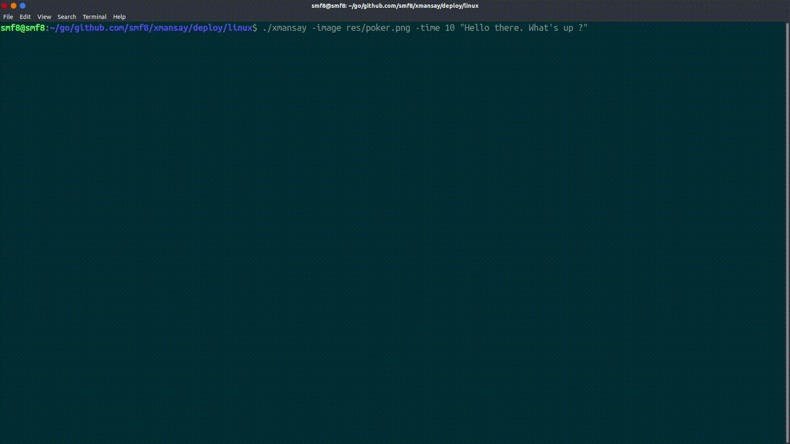

# xmansay
a poor duplicate of xcowsay 

for usage you can `go get` the project for **but keep in mind that xmansay uses [qt binding for go](https://github.com/therecipe/qt)
so it might take a long time to build**.
and for building desired output for your enviroment use `qtdeploy build [linux/windwos/etc]`
don't forget to copy `res` folder to the generated `deploy` folder

**Demo:**

as there is no official API for rendering persian texts in go [#27281](https://github.com/golang/go/issues/27281), multiline farsi texts are not rendered correctly in this project.
